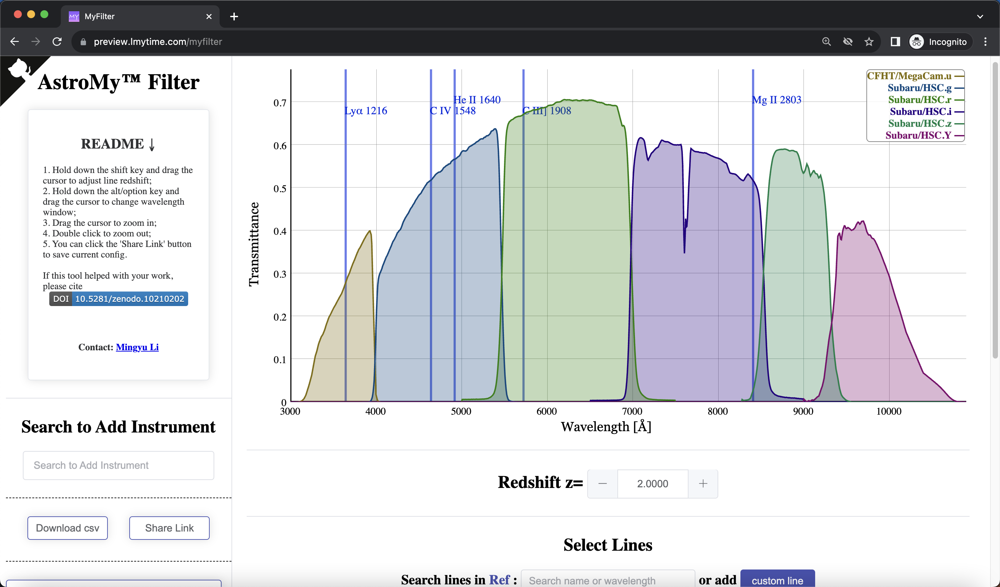

# MyFilter
[](https://doi.org/10.5281/zenodo.10210201)

MyFilter is a web app that provides interactive visualization of astronomical filters' transmission curves.

## Demo
A live demo of the app can be viewed here:

https://preview.lmytime.com/myfilter

JWST NIRCam customized version:

https://preview.lmytime.com/myfilter?cus=JWST



## Features
- Interactive transmission curves for common astronomical filters
- Overlay multiple filters for comparison
- Zoom in on specific wavelength ranges
- Check emission or absoption lines for any redshift

## Usage
The app is simple to use. Just select the filters you want to visualize from the sidebar. Hover over the graph for more details and use the mouse to zoom in on areas of interest.

Multiple filters can be overlaid to compare bandpasses.

## Deployment
We provide a way to deploy using docker on your own.

First pull the docker image:
```sh
docker pull lmytime/myfilter
```
Then run the docker image as container:
```sh
docker run -it --rm -p 9899:9899 lmytime/myfilter
```
Finally, you can open the software on:
- `http://127.0.0.1:9899`

## Development
The app is built based on:

- [Vue.js](https://vuejs.org/)
- [dygraphs](https://dygraphs.com/) for data visualization
- [ElementPlus](https://element-plus.org/) for styling
- [Flask](https://flask.palletsprojects.com/)
- The filter data is from the [SVO](http://svo2.cab.inta-csic.es/theory/fps/index.php) website.
- Some data are from users:
  - `JWST_xxx`: xxx represents MIRI, NIRISS, NIRCam, and NIRSpec. These data are from JWST ETC v2.0.
  - `DECam-Merian`: Filters designed in [Merian Survey](https://merian.sites.ucsc.edu/).
  - `MOIRCS`: Subaru MOIRCS

## Contributing
Contributions are welcome! Please create an issue or open a pull request if you would like to add a feature or fix a bug.

## License
This project is open source and available under the MIT License.

## Acknowledgment
[](https://doi.org/10.5281/zenodo.10210201)

If you publish any work that uses MyFilter, please cite the software by linking to the Zenodo DOI as follows:

In `bibtex`:
```bibtex
@misc{MyFilter,
  author       = {Li, Mingyu},
  title        = {{MyFilter: A Web Application for Interactive Visualization of Astronomical Filter Transmission Curves}},
  month        = nov,
  year         = 2023,
  publisher    = {Zenodo},
  version      = {1.0.0},
  doi          = {10.5281/zenodo.10210201},
  url          = {https://doi.org/10.5281/zenodo.10210201}
}
```

Optionally, it is preferred to attach the Github repo link in the footnote:
```latex
\footnote{\url{https://github.com/lmytime/MyFilter}}
```
